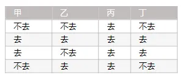
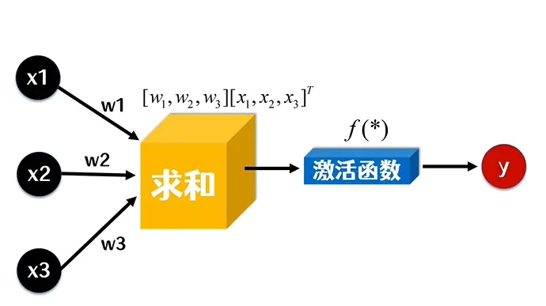
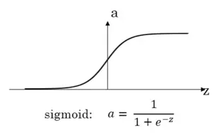

# [single-neure](https://github.com/NN-Studio/single-neure)
单个神经元

## 问题描述

我们的问题是四个人，甲、乙、丙、丁，下面是他们之前去不去看电影的数据：



现在的问题是，如果下次可以确定：甲去、乙去、丙不去，那么丁去的概率是多少？

## 单节点神经网络

我们的模型如下：



x1、x2、x3分别表示甲、乙、丙去不去的值，去就是1，不去是0。输出y表示丁去不去的值。

其中w1、w2、w3分别表示甲、乙、丙的权重，激活函数使用的是sigmoid，也就是：



权重进行随机，然后利用已知的值进行训练，不停调整权重，最终，把需要求解的数据输入获取结果即可。

## 代码实现

具体代码见： [./index.js](./index.js)

## 关于权重调整为什么要乘上输入值的理解?

```js
weights[k] += seedData[j][k] * delta;
```

可以看见，权重的调整最终增加的值是seedData[j][k] * delta

为什么？

delta 的值和error的正负性上保持一致，激活函数是单调递增的，如果error大于0，那么调整后激活函数的输入应该变大，可是输入可能大于0也可能小于0，怎么办？

如果增加的权重乘上输入，那么实际激活函数输入的改变就是：

```js
seedData[j][k] * seedData[j][k] * delta = seedData[j][k]的平方 * delta
```

也就是改变量的正负和delta保持一致，这样，目的就达到了。

## 版权

MIT License

Copyright (c) [zxl20070701](https://zxl20070701.github.io/notebook/home.html) 走一步，再走一步
